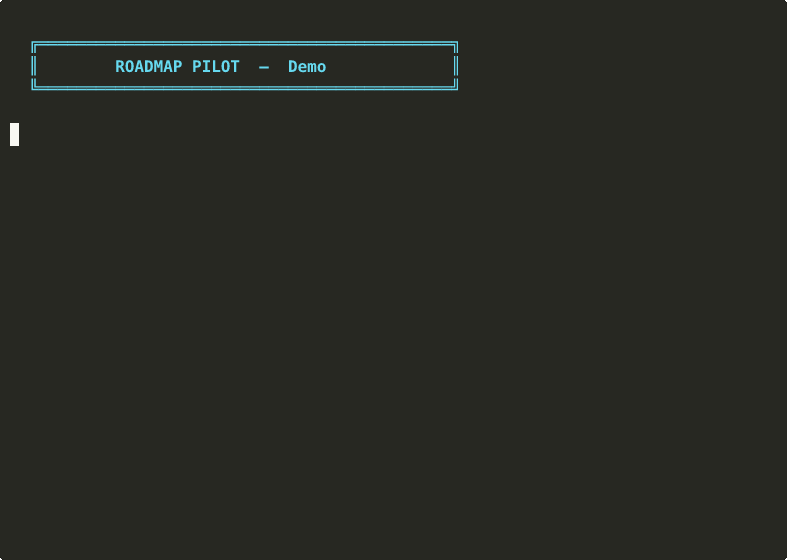

# roadmap-pilot

> Roadmap-driven autopilot for Claude Code. Plan it, then execute it. One task per session, zero hallucinations.

<!-- Badges -->


## The Problem

Claude Code is powerful but forgets everything between sessions. Large refactoring tasks cause context overflow and hallucinations. Manual tracking in CLAUDE.md works but is tedious.

## The Solution

Two skills that split the work:

```
/init-roadmap          CLAUDE.md           /roadmap
 (architect)    →→→    (contract)    →→→    (builder)
  scan project,        phases,              read next task,
  interview user,      conventions,         execute ONE,
  generate plan        checklist            commit, handoff
```

| Skill | Role | Mode | Trigger |
|-------|------|------|---------|
| `init-roadmap` | Architect | Conversational | `/init-roadmap` |
| `roadmap-pilot` | Builder | Deterministic | `/roadmap` |
| `roadmap-pilot` | Preview | Read-only | `/roadmap --dry-run` |

## Quick Start

### 1. Install

**As a plugin (recommended):**
```
/plugin marketplace add antonioconsales/roadmap-pilot
/plugin install roadmap-pilot
```

**Or copy manually:**
```bash
cp -r .claude/ /your-project/.claude/
```

### 2. Plan (once)

```
/init-roadmap
```

Claude scans your project, asks targeted questions, generates a phased roadmap in `CLAUDE.md`.


### 3. Preview (optional)

```
/roadmap --dry-run
```

Claude reads `CLAUDE.md`, finds the next task, analyzes the target file(s), and shows you exactly what it would do — without touching anything. Useful for reviewing before executing.

### 4. Execute (repeat)

```
/roadmap
```

Claude reads `CLAUDE.md`, executes ONE task, marks it done, commits, hands off.



### 5. Autopilot (optional)

```bash
.claude/skills/roadmap-pilot/scripts/auto-roadmap.sh
```

Runs `claude -p` in a loop. Each call = fresh session. Stops when done or stuck.


## Scripts

| Script | What it does |
|--------|-------------|
| `status.sh` | Visual progress dashboard with bars per phase |
| `next-task.sh` | Shows next task and progress count |
| `auto-roadmap.sh` | Full autopilot loop |
| `rollback.sh` | Safely reverts the last roadmap commit |
| `scan-project.sh` | Analyzes project structure (used by init-roadmap) |

### Progress Dashboard

```bash
.claude/skills/roadmap-pilot/scripts/status.sh CLAUDE.md
```

```
  ROADMAP PROGRESS
  ─────────────────────────────────────────────

  Phase 1 - Shared Types      ████████████████████ 3/3 (100%)
  Phase 2 - Core Utilities     ████████░░░░░░░░░░░░ 2/5 (40%)
  Phase 3 - Components         ░░░░░░░░░░░░░░░░░░░░ 0/8 (0%)
  ─────────────────────────────────────────────

  TOTAL                        ██████░░░░░░░░░░░░░░ 5/16 (31%)

  Next: Type `src/utils/validators.ts`
```

### Rollback

```bash
# Preview what would be reverted
.claude/skills/roadmap-pilot/scripts/rollback.sh --dry-run

# Actually revert
.claude/skills/roadmap-pilot/scripts/rollback.sh
```

## Templates

Don't want to start from scratch? Use a template as your `CLAUDE.md`:

| Template | Use case |
|----------|----------|
| `templates/typescript-typing.md` | Add types to a TS project |
| `templates/react-migration.md` | Modernize React (class → hooks, HOCs → hooks) |
| `templates/python-typing.md` | Add type hints to Python |
| `templates/general-refactoring.md` | Generic cleanup and restructuring |
| `templates/monorepo.md` | Monorepo with multiple packages |
| `templates/large-refactor.md` | Major restructuring (move, split, extract) |
| `templates/bug-fixing-batch.md` | Systematic batch bug fixing by priority |

```bash
cp templates/typescript-typing.md /your-project/CLAUDE.md
# Edit to match your project, then run /roadmap
```

Or let `/init-roadmap` generate a custom one from scratch.

## What init-roadmap produces

A `CLAUDE.md` like this:

```markdown
# MyApp

E-commerce frontend built with Next.js and TypeScript.

## Working With Claude
- **Branch**: `refactor/typing-cleanup`
- **Commit prefix**: `[typing]`

## Conventions
- Shared types in `src/types/`
- Use `type` instead of `interface`

## Roadmap

### Phase 1 - Shared Types
- [x] Create `src/types/api.ts` with API response types
- [x] Create `src/types/models.ts` with domain model types

### Phase 2 - Core Utilities
- [ ] Type `src/utils/formatters.ts`
- [ ] Type `src/utils/validators.ts`
```

## Rules Enforced

### init-roadmap (planning)
- Only plans, never executes
- Never modifies source code
- Shows full output before saving
- Only references files it has actually scanned

### roadmap-pilot (execution)
- **ONE task per session** — no exceptions
- **Never changes logic** — behavior stays identical
- **Never pushes to remote** — local commits only
- **Never skips hooks** — no `--no-verify`
- **Reads before editing** — never edits blind
- **Commits CLAUDE.md with code** — progress always tracked

## Works With Any Cleanup

Not just TypeScript typing. Works with:

- Type annotations (TS, Python, Go)
- Refactoring (extract, split, merge)
- Renaming (variables, files, directories)
- Migration (API changes, framework upgrades)
- Restructuring (move, reorganize)
- Cleanup (dead code, unused imports)

**Principle: plan once, execute incrementally, one task per session.**

## Real-World Example: Step by Step

Here's exactly what happens when you use roadmap-pilot on a React Native project:

**Step 1: Plan** — You run `/init-roadmap` in your project.

Claude scans it and asks:
> Found 147 .ts files, 89 contain `any`. Goal? → "Remove all `any` types"
> Branch? → Creating `refactor/typing`
> Where should shared types live? → `src/types/index.ts`

It generates a `CLAUDE.md` with 23 tasks across 5 phases.

**Step 2: Execute** — You open a new session and run `/roadmap`.

Claude reads `CLAUDE.md`, finds:
```
- [ ] Type `src/utils/helpers.ts`
```
It reads the file, replaces 12 `any` types, imports shared types, marks the task `[x]`, commits:
```
[typing] type src/utils/helpers.ts
```
And says: *"Done. Open a new session and say: continue the roadmap"*

**Step 3: Repeat** — You open a new session, run `/roadmap` again. Next task. Same flow.

**Step 4: Autopilot** — Tired of opening sessions manually? Run:
```bash
./auto-roadmap.sh CLAUDE.md
```
It launches 23 Claude sessions back-to-back, each doing one task. Go grab a coffee.

After 23 sessions: `ROADMAP COMPLETED! 23/23 tasks done.`

## Writing Good Tasks

The quality of your roadmap determines how well Claude executes. Follow these rules:

| Rule | Good | Bad |
|------|------|-----|
| Be specific | `Type src/utils/helpers.ts` | `Type utility files` |
| One file per task | `Type src/api/users.ts` | `Type all API files` |
| Include context | `Extract shared types to src/types/api.ts` | `Extract types` |
| State the goal | `Replace any with proper types in formatters.ts` | `Fix formatters` |
| Keep it atomic | `Rename getData → fetchUserProfile in users.ts` | `Rename all functions` |

**Tasks to avoid:**
- `Refactor the auth system` — too vague, split into specific sub-tasks
- `Fix all bugs` — each bug should be its own task
- `Update tests` — specify which tests and what changes
- `Clean up code` — what exactly needs cleaning?

**The golden rule:** Could a developer with no context read this task and know exactly what to do? If yes, Claude can too.

## Testing

Run the regression test suite:

```bash
./tests/test-scripts.sh
```

Tests cover:
- `next-task.sh`: finds correct task, ignores non-roadmap checkboxes, handles edge cases
- `status.sh`: shows correct progress per phase, ignores QA sections
- `scan-project.sh`: detects frameworks, git status, existing CLAUDE.md

## Project Structure

```
roadmap-pilot/
├── .claude/
│   ├── settings.json              # Hooks for reliable activation
│   └── skills/
│       ├── init-roadmap/          # Planning skill
│       │   ├── SKILL.md
│       │   └── scripts/
│       │       └── scan-project.sh
│       └── roadmap-pilot/         # Execution skill
│           ├── SKILL.md
│           └── scripts/
│               ├── auto-roadmap.sh
│               ├── next-task.sh
│               ├── rollback.sh
│               └── status.sh
├── .github/workflows/test.yml     # CI/CD: tests, lint, validation
├── tests/
│   └── test-scripts.sh            # 30 regression tests
├── templates/                     # Ready-to-use CLAUDE.md templates
│   ├── typescript-typing.md
│   ├── react-migration.md
│   ├── python-typing.md
│   ├── general-refactoring.md
│   ├── monorepo.md
│   ├── large-refactor.md
│   └── bug-fixing-batch.md
├── marketplace.json               # Plugin marketplace manifest
├── plugin.json                    # Plugin metadata
└── README.md
```

## Future Roadmap

Ideas under consideration for future versions:

- **Completion report** — Summary of all completed tasks when the roadmap finishes
- **Session metrics** — Track tasks/session, average time, and blocked tasks
- **Enterprise mode** — Policy enforcement, audit trail, CLAUDE.md signing
- **Company standard templates** — Standardized templates for team-wide use

Have an idea? [Open an issue](https://github.com/antconsales/roadmap-pilot/issues).

## License

MIT
